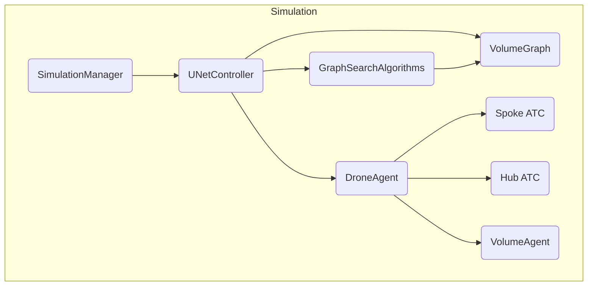

# Architecture.md — FoldSpace System Design

This document outlines the core architectural components and flow of control within the FoldSpace drone simulation. The simulation models a centralized airspace structure where ML-agents (drones) navigate through a 4D volume grid, managed by deterministic controllers such as ATC and UNetController.

---

## High-Level System Overview

The FoldSpace simulation is composed of:

* **Dynamic Drone Agents**
* **A Centralized Airspace Controller (UNetController)**
* **Spoke and Hub ATCs**
* **A Lazy 4D Grid Planner (VolumeGraph)**
* **A Simulation Orchestrator (SimulationManager)**
* **Visual and Debug Interfaces**

---

## Key Components

### 1. `SimulationManager`

* **Role:** Master runtime orchestrator
* **Responsibilities:**

  * Spawn drone agents on a timed loop
  * Assign origin/destination ATC pairs
  * Use `UNetController.AssignPath(...)` to assign unique 4D paths
  * Attach cameras and UI panels

### 2. `UNetController`

* **Role:** Centralized UTM-style path planner
* **Responsibilities:**

  * Calls `VolumeUtils.FindClosestAgent(...)` for start and goal nodes
  * Uses `GraphSearchAlgorithms.AStar(...)` to find a 4D route
  * Reserves all `VolumeAgent`s along the path using a unique flight ID
  * Rejects overlapping or unavailable routes
  * Provides visualization hooks for debug view

### 3. `VolumeGraph`

* **Role:** World-space and time-space graph model
* **Lazy Instantiation:** Nodes (`VolumeAgent`) are created on-demand using `GetOrCreateAgent(...)`
* **Time Wrapping:** Limits 4D matrix size via cyclic time behavior
* **Neighbors:** Only spatial neighbors at t+1 are considered

### 4. `VolumeGridBuilder`

* **Role:** Configuration authority for the 4D grid
* **Responsibilities:**

  * Holds spatial dimensions (x, y, z) and time step count (t)
  * Defines `volSize`, `droneSpeed`, and `globalOffsetY`
  * Stores metadata in `VolumeGraph` without generating nodes

### 5. `ATCController`

* One at each vertiport (hub + spokes)
* **Role:** Event emitter for takeoff/landing
* **May later expand to:** Queueing, pad availability, rerouting

---

## Information Flow

---

## Design Constraints

* **Memory-Constrained Planning:** Grid is lazy + cyclic
* **Fixed Terrain Reference:** Volume nodes avoid terrain collision
* **Deterministic Scheduling:** SimulationManager controls all launch timing
* **Centralized Planning First:** Later versions may decentralize UTM logic

---

For concrete examples of how agents behave within this architecture, see `Agents.md`.
